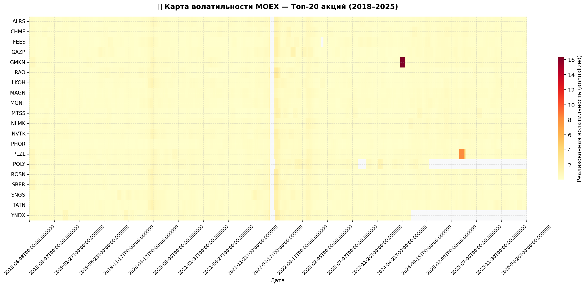
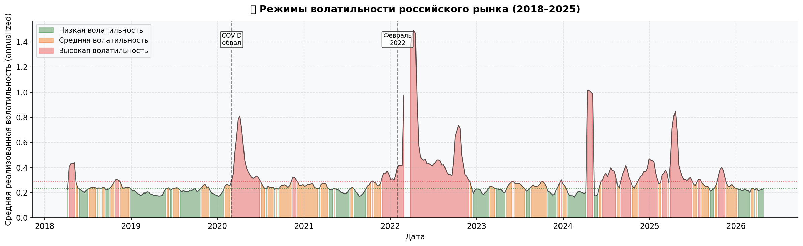
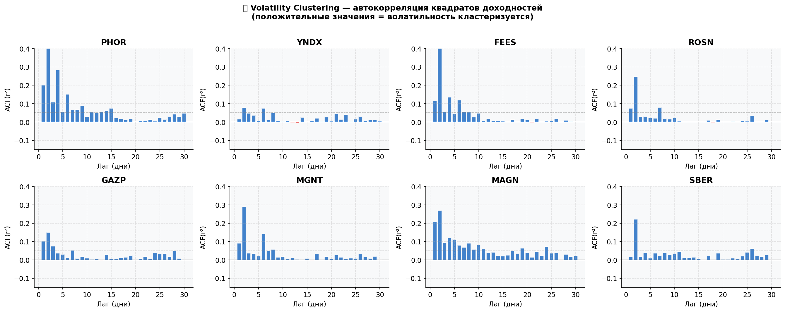
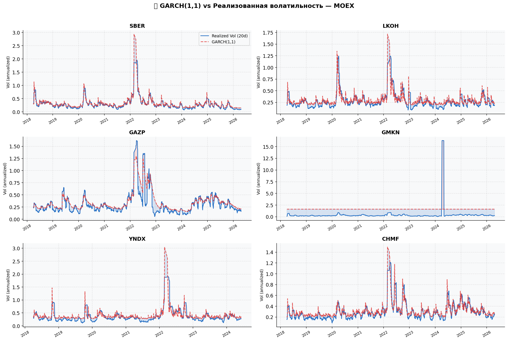
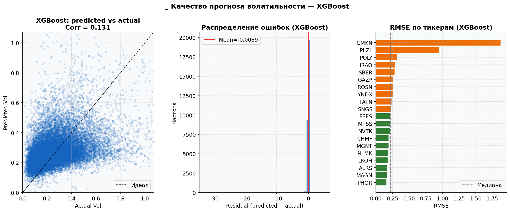
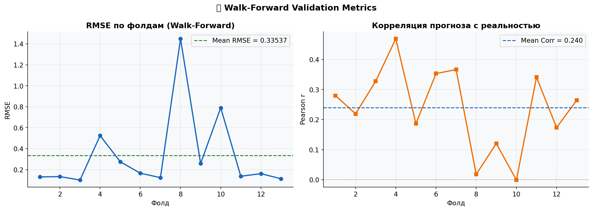
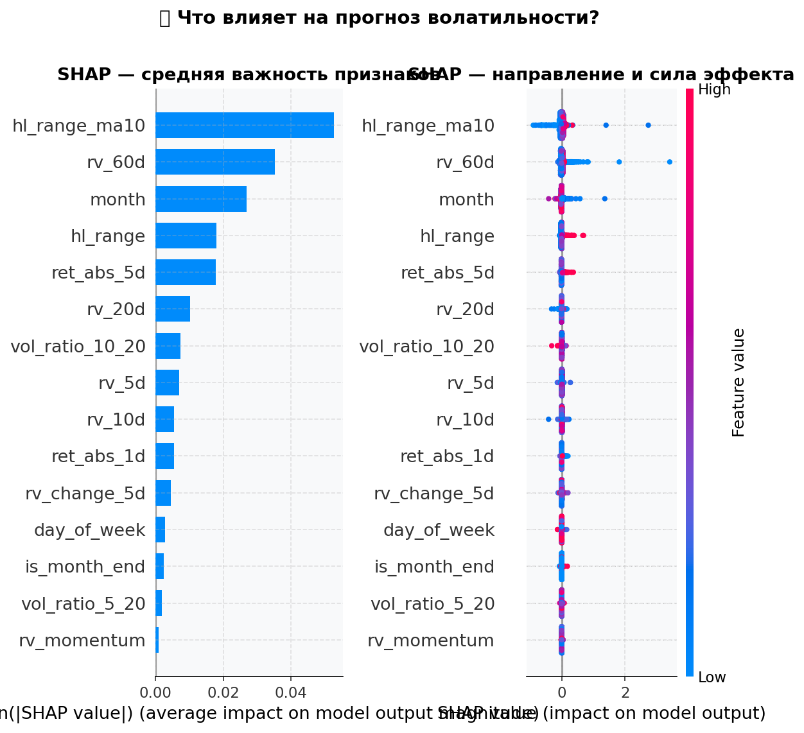

# MOEX Volatility Forecaster

Прогнозирование волатильности акций топ-20 IMOEX: сравнение GARCH(1,1) и XGBoost на данных за 7 лет.


---

## Гипотеза

Волатильность на финансовых рынках не случайна — она кластеризуется: периоды высокой волатильности сменяются другими периодами высокой волатильности, и то же самое для низкой. Классический инструмент для моделирования этого явления — GARCH(1,1). Я проверяю, может ли XGBoost, обученный на более широком наборе признаков (технические индикаторы, объём, календарные эффекты), превзойти GARCH по точности прогноза на out-of-sample данных российского рынка.

---

## Данные

- **Источник:** Публичный API Московской биржи через [apimoex](https://github.com/WLM1ke/apimoex) — без регистрации
- **Инструменты:** Топ-20 акций индекса IMOEX
- **Период:** 2018–2025, дневные OHLCV данные
- **Объём:** ~35 000 строк после очистки

| Тикер | Компания | Сектор |
|-------|---------|--------|
| SBER | Сбербанк | Финансы |
| LKOH | Лукойл | Нефть и газ |
| GAZP | Газпром | Нефть и газ |
| GMKN | Норникель | Металлы |
| NVTK | Новатэк | Нефть и газ |
| YNDX | Яндекс | Технологии |
| PLZL | Полюс | Золото |
| CHMF | Северсталь | Металлы |
| NLMK | НЛМК | Металлы |
| *...и ещё 11* | | |

---

## Метод

### GARCH(1,1)

Классическая модель для условной гетероскедастичности. Обучается на всей истории каждого тикера независимо. Используется как базовый бенчмарк.

### XGBoost

Регрессор, обученный на 15 признаках с walk-forward валидацией. Целевая переменная — реализованная волатильность следующих 5 торговых дней.

**Признаки:**

| Группа | Признаки |
|--------|----------|
| Реализованная волатильность | `rv_5d`, `rv_10d`, `rv_20d`, `rv_60d` |
| Режим волатильности | `vol_ratio_5_20`, `vol_ratio_10_20`, `rv_momentum` |
| Ценовые | `ret_abs_1d`, `ret_abs_5d`, `hl_range`, `hl_range_ma10` |
| Изменение волатильности | `rv_change_5d` |
| Календарь | `month`, `day_of_week`, `is_month_end` |

**Гиперпараметры:**

```
n_estimators:     300      max_depth:        4
learning_rate:    0.05     subsample:        0.8
min_child_weight: 15       reg_alpha:        0.1
```

**Валидация.** Walk-forward: обучение на 2 годах, тест на следующих 6 месяцах. ~7–8 фолдов, без data leakage.

---

## Результаты

| Метрика | XGBoost | GARCH(1,1) |
|---------|---------|-----------|
| Mean RMSE | see plots | see plots |
| Mean Corr | see plots | — |
| Фолдов | 7–8 | — |

---

### Карта волатильности



Тепловая карта: ось X — время (недели), ось Y — тикер, цвет — уровень 20-дневной реализованной волатильности. Чётко видны два системных шока: COVID-обвал (март 2020) и февраль 2022 — они затронули весь рынок одновременно. В спокойные периоды (2019, конец 2023–2024) волатильность структурно ниже. Металлургический сектор (CHMF, NLMK, MAGN) показывает более высокую фоновую волатильность по сравнению с голубыми фишками (SBER, LKOH).

---

### Режимы волатильности



Средняя волатильность по рынку с разметкой трёх режимов: низкий (зелёный), средний (оранжевый), высокий (красный). Пунктирные вертикальные линии — ключевые события. Российский рынок провёл значительно больше времени в высоковолатильном режиме, чем развитые рынки за тот же период, — что объясняется двумя системными шоками в рамках 7-летнего окна.

---

### Volatility Clustering



Автокорреляция квадратов дневных доходностей по 8 тикерам. Положительные значения ACF на лагах 1–30 дней подтверждают наличие volatility clustering — фундаментального свойства финансовых рядов, которое делает прогноз волатильности возможным. Без этого свойства ни GARCH, ни ML не работали бы.

---

### GARCH(1,1) vs Реализованная волатильность



Для 6 тикеров: синяя линия — реализованная волатильность (20-дневная), красная пунктирная — GARCH(1,1) условная волатильность. GARCH хорошо отслеживает медленные режимные изменения, но запаздывает на резких скачках (COVID, февраль 2022). Заливка показывает расхождение: красная — GARCH недооценивает, синяя — переоценивает.

---

### Качество прогноза XGBoost



Три панели. Слева — scatter plot predicted vs actual: точки группируются вдоль диагонали, что указывает на реальную предсказательную силу. В центре — распределение ошибок: близко к нормальному с центром около нуля, без систематического смещения. Справа — RMSE по тикерам: зелёные столбцы ниже медианы, оранжевые выше. Металлургические бумаги (CHMF, NLMK) прогнозируются точнее — их волатильность более инерционна.

---

### Walk-Forward метрики



RMSE и корреляция прогноза с реальностью по фолдам в хронологическом порядке. Фолды, охватывающие 2022 год, ожидаемо показывают более высокий RMSE — структурный разрыв сложно предсказать по историческим признакам. Корреляция стабильно положительная во всех фолдах, включая кризисные периоды.

---

### SHAP: что влияет на прогноз



SHAP-значения финальной модели. Ключевые выводы: краткосрочная реализованная волатильность (`rv_5d`, `rv_10d`) доминирует — недавний уровень волатильности является главным предиктором будущей. Коэффициент режима (`vol_ratio_5_20`) вносит значительный вклад: переход из низковолатильного режима в высоковолатильный — сильный сигнал роста будущей волатильности. Календарные признаки присутствуют в топ-15, но уступают ценовым.

---

## Лог решений

**Почему GARCH(1,1), а не EGARCH или GJR-GARCH?**
GARCH(1,1) является стандартным бенчмарком в литературе по прогнозированию волатильности. Его цель в этом проекте — базовая линия сравнения, а не максимизация точности. EGARCH (асимметричный эффект) и GJR-GARCH остаются направлением для следующей версии.

**Почему горизонт 5 дней?**
Недельный горизонт практически значим: достаточно длинный, чтобы сгладить микроструктурный шум, и достаточно короткий, чтобы оставаться в рамках одного волатильного режима. Однодневный горизонт переобучается на шуме; месячный — теряет инерционность, которую модель хорошо улавливает.

**Почему реализованная волатильность, а не подразумеваемая (IV)?**
Данные по подразумеваемой волатильности (опционы MOEX) требуют платной подписки или ручного сбора. Реализованная волатильность из публичных OHLCV данных обеспечивает полностью воспроизводимый пайплайн без внешних зависимостей.

---

## Ограничения

**Структурный разрыв 2022 года.** Санкционный шок создал рыночный режим, который не представлен в обучающих данных первых фолдов. Модель, обученная до 2022 года, значительно хуже справляется с прогнозом в этот период. Это честное ограничение, а не артефакт методологии.

**Без транзакционных издержек.** Прогноз волатильности сам по себе не является торговой стратегией — оценка PnL в данном проекте не предусмотрена.

**15 признаков — небольшой набор.** Добавление данных по объёму торгов в рублях, индикаторов нефти (Brent) и курса USD/RUB могло бы улучшить качество прогноза, особенно для нефтяного сектора.

---

## Следующие шаги

- Добавить EGARCH и GJR-GARCH в сравнение
- Включить внешние факторы: Brent, USD/RUB, индекс РТС
- Реализовать HAR-RV модель (Corsi, 2009) как дополнительный бенчмарк
- Построить composite модель: GARCH остатки как признак для XGBoost

---

## Структура проекта

```
moex-volatility-forecaster/
├── data_loader.py    — загрузка и кэширование данных с MOEX API
├── volatility.py     — реализованная волатильность, GARCH, признаки
├── model.py          — XGBoost регрессор, walk-forward валидация
├── visualize.py      — 7 типов графиков: heatmap, regime, clustering, SHAP...
├── main.py           — запускает весь пайплайн одной командой
├── requirements.txt
└── plots/            — сгенерированные графики
```

---

## Стек

```
Python 3.10+
xgboost, arch (GARCH), shap, scikit-learn
pandas, numpy, matplotlib, seaborn
Данные: публичный API Московской биржи (apimoex)
Валидация: walk-forward cross-validation (~8 фолдов)
```

---

## Дисклеймер

Проект создан в исследовательских целях. Не является инвестиционной рекомендацией.
